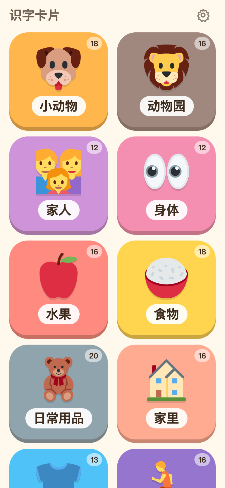
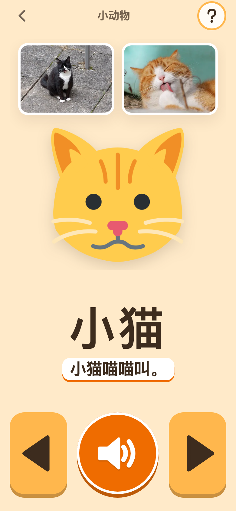
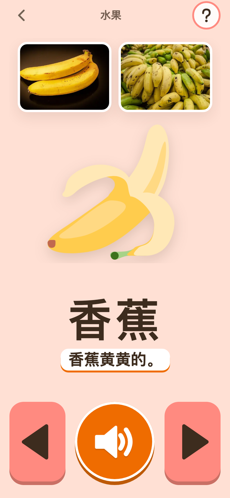
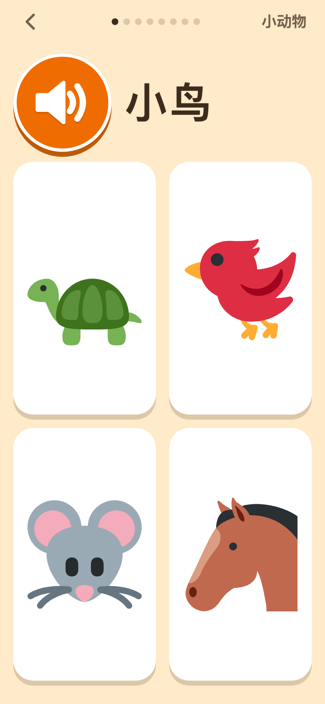

# 识字卡片

在线：**[kapian.jiaci.app](https://kapian.jiaci.app)**（手机 / iPad 打开后添加到主屏幕，离线可用）

给 **3 岁左右幼儿** 的看图听音认知卡片：一张卡 = 两张真实照片 + 一张插画 + 一个词 + 一句例句，点一下就朗读。中文 / 英文 / 中英文可切换。
纯前端、纯静态、零网络：图片和发音全部打包在应用里，装到主屏幕后离线可用，不联网、不埋点、不要账号。

使用者是不识字、手指点不准、注意力只有几分钟的孩子：所有孩子要用的操作都是大图标 + 颜色 + 声音，文字只是给旁边家长看的；不计时、不计分、不判对错，只有「看、听、说」。

<p align="center">
  
  
  
  
</p>

```bash
npm install
npm run dev          # http://localhost:5173
npm run build        # vue-tsc --noEmit && vite build → dist/（含 Service Worker 与 manifest）
npm run preview
npm run typecheck
npm test             # vitest：内容数据校验、朗读计划、朗读器状态机、小测验出题
npm run images       # 重新生成插画 → public/images/
npm run photos       # 重新挑照片 → public/photos/（见下文）
npm run audio        # 重新合成发音 → public/audio/（见下文）
npm run icons        # 重新渲染 PWA 图标与分享预览图 → public/icons/
npm run seo          # 生成 public/cards.html（不用 JS 的全部卡片清单页）、robots.txt、sitemap.xml；build / dev 前会自动跑
npm run screenshots  # npm run dev 之后：无头 Chrome 模拟 iPhone（真触摸）截 README 用的预览图到 screenshots/
```

## 孩子怎么用

- **首页**：17 块颜色不同的分类方砖，顺序固定（幼儿靠位置记）。点一块先听分类名，再滑入第一张卡。
- **卡片页**：上面是两张照片和一张插画，下面是词和一行例句。切到新卡自动朗读（先读词，再读例句；中英文模式下 中词 → 中句 → 英词 → 英句，例句行跟着正在读的语言切换，正在读的词高亮）。
  - 底部三个大按钮：**上一个 / 再听一遍 / 下一个**（最短边 ≥ 96px，按下回弹；喇叭在朗读时脉动）。
  - 点图片或点词 = 再听一遍；左右滑 = 换卡。点按用指针事件判定：另一根手指搁在屏幕上、两指同拍、按下去滚一下都能响，手掌整个拍上去只算一下。
  - 回首页再进同一分类，从上次看到的那张接着看（只在本次会话内记）。
- **小测验**：卡片页右上角的「?」进入，读一个词、四幅插画里点出对的那张。找错了只是「再试试」，第二次会指给孩子看，每一题都以找到结束；不计分、没有错误音效；一轮 8 题，做完可以再来一轮。
- **家长设置**藏在首页右上角：**长按齿轮 1.5 秒**（有进度环）才打开，孩子随手点不到；手指拖走或屏幕上再落下一根手指就取消。
- **装到手机上用**：没从主屏幕打开时，首页顶上有一条给家长的「安装 识字卡片」提示：Android / 电脑 Chrome、Edge 点「安装」直接弹系统安装框；iPhone / iPad 点「怎么做」看步骤（Safari 分享 → 添加到主屏幕，iPhone 在底部、iPad 在右上角，不在 Safari 里先教换 Safari）；微信 / QQ 里教先在浏览器打开。可关，3 天后再提醒，装好就不再出现；电脑上只在能一键安装时提示。
- 防误触：禁用双击 / 双指缩放、文字选中、图片长按菜单、下拉刷新、滚动回弹；卡片页屏幕常亮（Wake Lock，孩子盯着一张卡看很久也不黑屏）。
- 横竖屏都排得下：手机竖屏上图下字，平板横屏图左字右。

## 家长设置

| 项 | 说明 |
|---|---|
| 卡片显示 | 中文 / 英文 / 中英文，朗读跟随 |
| 自动朗读 | 关掉后只有点「再听一遍」或点图才读 |
| 读例句 | 关掉只读词、不显示例句 |
| 小测验 | 关掉后卡片页不显示「?」入口 |
| 显示哪些分类 | 隐藏暂时不想给孩子看的分类（至少留一个） |
| 离线与安装 | 离线包下载进度 / 是否就绪；能一键安装时给「安装到主屏幕」按钮，其它环境「查看步骤」（与首页提示同一份步骤面板）；没有声音时先调媒体音量 |
| 素材来源 | 页底折叠栏：插画与每张照片的作者、许可、原页面 |

设置只存在本机（localStorage）。页脚有防孩子误退出的提示：iPhone / iPad 用「引导式访问」，Android 用「屏幕固定」；还有一个「全部卡片清单」链接（`cards.html`，一页网页，家长过一遍词和例句用）。

## 内容

17 个分类 256 张卡（首页方砖右上角标着每个分类的张数），按 2–4 岁词汇发展排序：先是身边的动物、家人和自己的身体、吃的、家里的东西、动作和表情，抽象的颜色 / 数字 / 形状放最后。

| 分类 | 张 | 分类 | 张 | 分类 | 张 |
|---|---|---|---|---|---|
| 小动物 | 18 | 日常用品 | 20 | 大自然 | 18 |
| 动物园 | 16 | 家里 | 16 | 蔬菜 | 17 |
| 家人 | 12 | 衣服 | 13 | 颜色 | 11 |
| 身体 | 12 | 动作 | 16 | 数字 | 10 |
| 水果 | 16 | 表情 | 13 | 形状 | 11 |
| 食物 | 18 | 交通工具 | 19 | | |

内容在 `src/content/<分类>.ts`，一个分类一个文件，每张卡一行：

```ts
{ id: 'frog', zh: '青蛙', en: 'frog', emoji: '🐸', sentence: { zh: '青蛙呱呱叫。', en: 'The frog says ribbit.' },
  say: { zh: '[青蛙]呱呱叫。' }, scene: 'frog pond', photos: ['Green frog on stone.jpg', 'Golden-eyed tree frog (Agalychnis annae).jpg'] }
```

- `zh` 优先幼儿口语的双音节词；`sentence` 是一句短例句；`emoji` 决定插画；`scene` 是找照片用的英文场景短语，要和例句对应。
- `say`（可选，按语言）：合成出来的读音不对时用。可以换同音字，也可以写载体句 `'[青蛙]呱呱叫。'`——把孤立读会变调的词放进句子里合成，再按词边界裁出方括号里的那段。
- `photos`（可选）：手选的 Wikimedia Commons 文件名；`[]` 表示这张卡不配照片。

加一张卡 = 加一行 → `npm run images` → `npm run audio` → `npm run photos` → `npm test`。测试会检查 id 唯一、例句格式、每张卡的插画 / 词与例句音频都在、清单一致、照片与出处对得上。

## 同一作者的其它学习应用

首页底部和 `cards.html` 页脚的「更多应用」链到这三个站：

- [AI加词](https://jiaci.app)：背单词，FSRS 间隔重复、AI 填充的词条资料、真人级发音。
- [同步练](https://tongbulian.jiaci.app)：人教版小学同步练习，按单元随机出题、汉字注音、题目朗读。
- [拼音学习机](https://pinyin.jiaci.app)：给学拼音的孩子的点读 / 拼读 / 跟读 / 测验键盘，真人录音。

## 素材

- **插画**（`public/images/`，273 个 SVG）：[Twemoji](https://github.com/jdecked/twemoji)（CC-BY 4.0），`npm run images` 从 `@twemoji/svg` 拷出；颜色、形状、数字、草由 `scripts/draw.ts` 自绘。
- **照片**（`public/photos/`，464 张，约 10 MB）：[Wikimedia Commons](https://commons.wikimedia.org/)，只收 CC0 / 公有领域 / CC BY / CC BY-SA 的图，`npm run photos` 先按 `scene` 场景短语、再按名词搜索，挑选后用 sharp 裁成 480×360 WebP；每张的作者、许可与来源页在 `public/photos/credits.json`。`npm run photos -- --sheet` 把现有照片拼成审片图肉眼过一遍，`-- --candidates dog,cat` 列出某几张卡的全部候选与被过滤原因，`-- --only dog` 只重做一张。
- **发音**（`public/audio/`，1068 个 mp3，约 11 MB）：微软 Edge 朗读接口（Edge-TTS）合成，中文 `zh-CN-XiaoxiaoNeural`、英文 `en-US-JennyNeural`，语速 -15%；`npm run audio` 合成后裁静音、响度归一，按 `manifest.json` 只重做文本 / 音色 / 参数变过的段。`-- --report` 列每段有声长度，`-- --audition rain,horse` 用几个候选音色各合成一份到 `.audition/` 试听。音频文件播不出时退到浏览器 Web Speech。

来源与许可汇总见 [NOTICE.md](NOTICE.md)。

## 结构

Vite + Vue 3（Composition API）+ TypeScript + Vue Router（hash 路由，`base: './'`，`dist/` 放到任意静态托管的任意子目录都能用；要 HTTPS 才有 Service Worker 与「添加到主屏幕」，直接双击 `dist/index.html` 会被 file:// 的跨域限制拦住，不作为使用方式）。原生 CSS + design tokens，没有状态库、没有 UI 框架、没有后端。

```
src/
  content/              一个分类一个文件；categories.ts 定首页顺序；paths.ts 是资源路径约定；prompts.ts 是小测验的提示语
  composables/
    speaker.ts          朗读器状态机（打断 / 追加 / 自动播放被拦则静默 / 看门狗），可单测
    useSpeaker.ts       <audio> 适配与全局单例；busy（在播）与 current（读到哪段）
    speechPlan.ts       显示模式 → 要读哪些段、要预加载哪些文件（含小测验的 提示语 → 词）
    quiz.ts             小测验出题（纯函数，可注种子）
    usePress.ts         孩子用的按钮 / 方砖 / 图片区的点按判定：不靠 click，整页只认一根手指
    useSettings.ts      家长设置（localStorage，带版本迁移）
    useLongPress.ts     家长入口的长按
    usePwa.ts / useWakeLock.ts
  views/                Home（分类方砖）/ Cards（卡片）/ Quiz（小测验）/ Settings（家长设置）
  components/           BigButton（孩子用的大按钮）/ CategoryTile / AppIcon
  styles/               tokens.css 设计变量；base.css 防误触与全局样式
  sw.ts                 自写的 Service Worker：预缓存全部资源 + Range 请求（iOS 才播得出缓存里的 mp3）
scripts/                images / photos / audio / icons / seo 五个生成脚本，screenshots.mjs 截 README 预览图 → screenshots/
public/                 images/ photos/ audio/ icons/ 生成的素材
```

SEO：应用是 hash 路由的单页，所以根页面带完整的标题 / 描述 / Open Graph / JSON-LD 和一段脚本跑起来前的静态内容，另有一页不用 JS 的 `cards.html` 列出全部卡片的词与例句（构建前由 `scripts/seo.ts` 生成，不进仓库）。在 `.env` 里放 `VITE_SITE_URL=https://你的域名/路径`（不带末尾斜杠），构建时会据它生成 canonical、`og:image` 与 `sitemap.xml`。

Service Worker 预缓存整站（约 20 MB）：6 路并发下载、单个文件失败自动重试、设置页显示进度；有新版本时不会立刻刷新（会打断正在看卡片的孩子），等回到首页且没在朗读时再切换。部署时 `sw.js`、`index.html`、`manifest.webmanifest` 不要套长缓存（`Cache-Control: no-cache`），带 hash 的 `assets/*` 可以长缓存，`photos/` `audio/` `images/` 由 SW 按 revision 更新、HTTP 层缓存一天即可。

## 许可

代码以 [MIT](LICENSE) 许可开源。`public/` 下的素材不在此列，各自沿用原来的许可：插画 Twemoji（CC-BY 4.0）、照片 Wikimedia Commons（每张的许可与作者在 `public/photos/credits.json`）、发音由 Edge-TTS 合成；详见 [NOTICE.md](NOTICE.md)。
